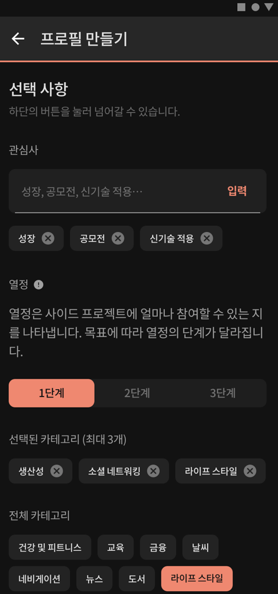
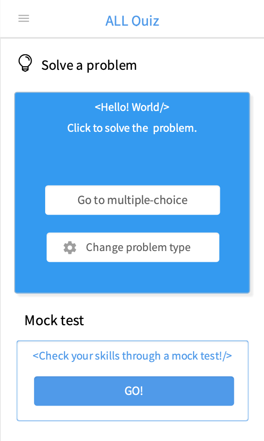

## 이력서

  

#### 춤을 좋아하는 안드로이드 개발자 김유정입니다 :)

- 이름: 김유정

- Email: pointu341@gmail.com

- GitHub: https://github.com/YuChocopie 

- 취미: 춤, 바다낚시, 해커톤

   

## 활동

- Mash-up  (2018.03 - 현재)
- 멋쟁이 사자처럼 7기 운영진 (2019.01 - 2019.12)
- 대학생벤처기사단이 UKOV 20기 (2019.07 - 2019.12)
- Gaudio- 인턴 (2019.07 - 2019.08)

## 사용 기술

#### Android

- Java

- Kotlin

- MVP, MVVM Pattern
- DataBinding
- 기타 : glide, retrofit, TweenAnimation, JNI

#### Server

- NodeJS
- Spring-Kotlin

#### Process

- Mornitoring - Google Analytics
- Communication - Slack
- Issue tracking - Github / Jira(애자일/칸반) 

## 프로젝트

### [Torchlight](https://github.com/2AO/Torchlight-Android)

- 기간 : 2019.10 ~ 현재
- 소개 : kotlin 기반 사이드프로젝트 팀원을 모집해주는 토이프로젝트

- 역할 : androidkotlin해시태그 추가나 선택버튼 등 구현에 오래걸리는 부분들은 커스텀뷰를 따로 제작, 프로젝트 생성부분을 담당
- 사용한 Skill 또는 지식 : Android, ViewPager2,koin, MVVM pattern, Databinding

### [MOTI](https://github.com/YuChocopie/Ahobsu-Node-Backend)

- 기간 : 2019.10 ~ 현재
- 소개 : 매일매일 미션을 수행하며 카드를 수집하는 ios 앱의 서버 담당.
- 역할 : 답변생성과 조회, 이미지파일 업로드, 서버시간에  밎춰 주차별로 묶어 data 제공
- 사용한 Skill 또는 지식 : NodeJS, express, mysql, sequilze, jest, swagger, jwt

### [friendlyCoding - 코딩공주 시에나 (블록 코딩 게임)](https://github.com/YuChocopie/FriendlyCoding)
- 기간 : 2019.09 ~ 2019.12
- 소개 : Kotlin 기반의 코딩 입문자를 위한 블록 코딩 게임 앱으로 주어지는 미션을 해결할 수 있는 코드를 작성하며 블록 코딩으로 문제를 간단하게 해결하고 단계별로 코드 작성에 있어 필수적인 요소인 조건문(if)과 반복문(for, while), 변수와 함수에 대해서 개념적으로 이해할 수 있게 한  앱
- 역할 : 프로젝트 리딩, 전체적인 레이아웃 디자인과  개발, androidx Data binding을 사용해 MVVM패턴 적용, 맵을 10x10 행렬로 제작하여 장애물이 랜덤으로 생성될 수 있도록 하고  실행버튼을 누를 경우 thread를 실행하여 옵저버를 통한 이벤트 케이스를 발생

- 사용한 Skill 또는 지식 : Android, git, TweenAnimation, Databinding, MVVM pattern

### live 음성변조 앱
- 기간 : 2019.08 ~ 2019.09

- 소개 : java 기반의 실시간으로 음성변조 앱 , 인턴기간중 회사의 sdk를 활용한 앱 제작

- 역할 : 안드로이드 어플리케이션 99%담당, 가우디오의 sdk 를 jni를 사용해 android studio 에서 사용할 수 있도록 변환, 소리에 대한 그래프를 시각적으로 표현, thread 를 사용해 음성의 녹음과 출력이 동시에 이루어질 수 있게  함, 실시간으로 앱에서 사용하는  memory를 출력
- 사용한 Skill 또는 지식 : Android,Design,  JNI, git, JIRA

### Android 기반 성능 모니터링 시스템
- 기간 : 2019.07 ~ 2019.08
- 소개 : 모바일 환경에서 기기의 버전과  sdk에 따라 다른 성능을 측정해주는 CI/CD 자동화 시스템
- 역할 : 성능측정 소스코드의 단순화, Android 기반 성능 모니터링 시스템 구축
- 사용한 Skill 또는 지식 : Android, JNI, bitbucket, Python, MySQL, react,  JIRA(애자일 스프린트), CI/CD, jenkins

### [개톡퍼스](https://github.com/YuChocopie/SMU_Quiz)
- 기간 : 2019.03 ~ 2019.09 
- 소개 : Kotlin 기반의 컴퓨터 전공관련 퀴즈 앱
- 역할 : 안드로이드 어플리케이션 90%담당, 그래프는 커스텀뷰 사용
- 사용한 Skill 또는 지식 : Android, Design, Databinding, MVVM pattern, retrofit2, gson

### [WeatherBear](https://github.com/YuChocopie/Olaf)

##### [store](https://play.google.com/store/apps/details?id=com.mashupgroup.weatherbear)

- 기간 : 2018.11 ~ 2019.03
- 소개 : kotlin 기반의  미세먼지,날씨에 따라 곰의 색과 악세사리, 배경날씨 등을 바뀌게 하여 사용자가 날씨에 대해 한눈에 알아볼 수 있도록 한 앱
- 역할 : Tween Animation 을 적용하여 곰의 각 신체부위를 움직임, Data binding을 사용해 MVVM패턴 적용, 기온을 나타내는 그래프는 커스텀뷰로 개발 
- 사용한 Skill 또는 지식 : Android, git, TweenAnimation, Databinding, MVVM pattern, retrofit2, ViewPager

### [Loling](https://github.com/YuChocopie/loling-android)
- 기간 : 2018.10 ~ 2019.02  
- 소개 : kotlin 기반 사용자의 연락처를 받아와 실체 친구들을 대상으로 롤링페이퍼를 써주는 방을 개설해 모으고 알람기능을 통해 이벤트 당일이 오면 사용자에게 알람이가 본인에게 온 롤링페이퍼들을 노출해주는 앱
- 역할 :  viewPager를 용도에 맞게 변경, recyclerView를 사용해 목록을 보여주는 부분에서 핸드폰 가로모드 적용시 가로 길이에 맞도록 item 라인 수 변경
- 사용한 Skill 또는 지식 : Android, git, data binding, MVVM pattern

### [Fry](https://github.com/YuChocopie/UNITHON-Fry)
- 기간 : 2018.07 ~ 2018.07
- 소개 : java 기반의 여름용 날씨 앱
- 역할 : 전체적 layout 생성, 위젯 제작
- 사용한 Skill 또는 지식 : Android

### [달서사(달콤한 서울의 사람들)](https://github.com/YuChocopie/BBKK-Android)
- 기간 : 2018.06 ~ 2018.10
- 소개 : java기반 계절에 따라 다른 배경과 사용자의 취향에 맞는 모션있는 캐릭터를 사용하여 친숙한 느낌을 강조한 서울의 4계절 관광지 추천 앱
- 역할 :  retrofit2를 사용에 data 받아오기, mvp 패턴 적용, 전체적인 layout 생성
- 사용한 Skill 또는 지식 : Android, retrofit2, gson, MVP pattern

 

### [Chatty](https://github.com/chatty-app/chatty-android) 
- 기간 : 2018.06 ~ 2018.10 
- 소개 : java기반 챗봇과의 대화를 통해 하루를 기록하고 이를 일기로 기록해주는 앱
- 역할 : 채팅화면에서 나인패치 적용, 채팅을 하는 ui에서 리사이클러뷰를 활용해 사용유저에 따라 채팅 말풍선이 바뀌게 함, 채팅작성 후 기분을 체크할 다이얼로그 구현, Diary 부분 구현
- 사용한 Skill 또는 지식 : Android, git, glide, TedBottomPicker, MVP pattern

## 수상 경력

상상만 하고 지나치는것을 메모해두고 기회가 올 때 아이디어를 쏟아내서 구현해보는 것을 좋아합니다.

**SMU게임경진대회(우수상)**

- 수상 날짜: 2019.12  

**금융 빅데이터 활용 아이디어공모전(최우수)**

- 수상 날짜: 2019.11  

**서울 통합이동서비스(MaaS) 해커톤(특별상)**

- 수상 날짜: 2019.08  

**SK브로드􏰂밴드 클라우드캠 개발공모전(최우수)**

- 수상 날짜: 2019.03  

**블록체인 문화예술 해커톤(우수상)**

- 수상 날짜: 2018.11  

**교통안전 아이디어 공모전(경찰청장상)**

- 수상 날짜: 2018.11  

